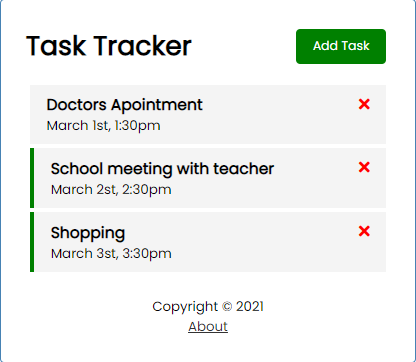

# Vue Task Tracker
> Credit to Brad Traversy on youtube, you can find the source video at [here](https://www.youtube.com/watch?v=qZXt1Aom3Cs)

## Project setup
### make sure npm is installed
```
npm install
```

### First, run the JSON-Server backend (http://localhost:5000)
```
npm run backend
```

### Run the Vue dev server (http://localhost:8080)
```
npm run serve
```

> The image below shows the home page of this app
> Each task can be deleted by clicking on the red X on the right of the UI
> Double click on a task to toggle its reminder (shows a green vertical bar on the left of task)
> Navigate to the about page 



> The image below shows the add task page of this app
> New task can be added by clicking the 'save task' button after filling the form


### Compiles and minifies for production
```
npm run build
```

### Customize configuration
See [Configuration Reference](https://cli.vuejs.org/config/).